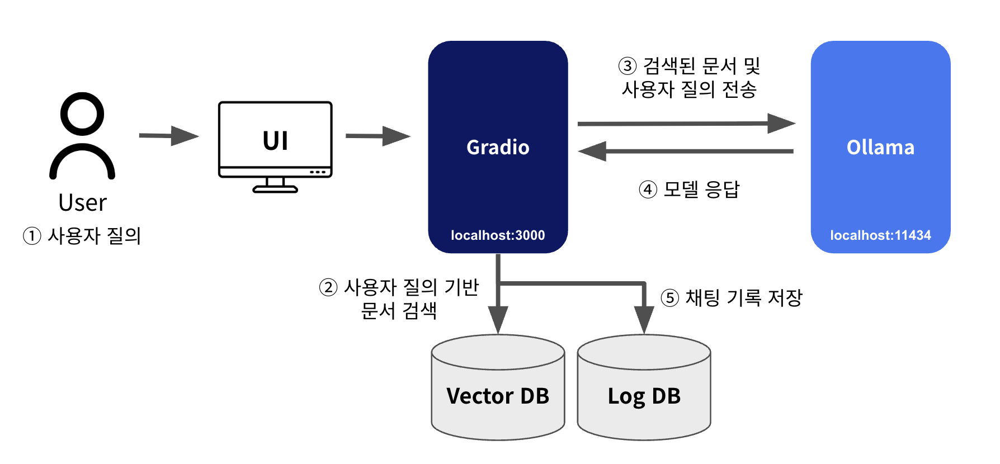

# 🏛️ 서울대학교 & 내담 빌딩온 챗봇 과제

환영합니다! 이 프로젝트는 서울대학교 LAAL 연구실과 내담 C&C가 협력하여 개발한 **소방법령 특화 질의응답 챗봇 시스템**입니다. 복잡한 소방법 관련 민원 질의에 대해 신속하고 정확한 답변을 제공하기 위해, 최신 인공지능 기술인 **RAG(Retrieval-Augmented Generation)** 를 기반으로 구축되었습니다.

## 🌟 프로젝트 개요

소방법은 우리 삶의 안전과 직결된 매우 중요한 법규이지만, 그 내용이 방대하고 전문적이어서 일반인이 이해하기 어려운 경우가 많습니다. '내담' 챗봇은 이러한 어려움을 해소하고자, **소방 관련 민원 질의응답 데이터**와 **실제 소방법령 문서**를 활용하여 사용자의 질문에 가장 적합한 답변을 찾아 제공합니다.

이 시스템은 다음과 같은 핵심 구성 요소를 통해 지능적인 답변을 생성합니다:

* **Gradio 인터페이스**: 사용자가 챗봇과 직관적으로 소통할 수 있는 웹 기반 사용자 인터페이스를 제공합니다.
* **Chroma 기반 VectorDB**: 소방법령 문서와 민원 질의응답 데이터를 효율적으로 저장하고 검색하는 벡터 데이터베이스입니다.
* **Ollama LLM 연동**: 사용자의 질문을 이해하고 답변을 생성하는 데 필요한 대규모 언어 모델(LLM)을 로컬 환경에서 구동할 수 있도록 Ollama와 연동됩니다. 이를 통해 민감한 데이터를 외부로 전송할 필요 없이 안전하게 시스템을 운영할 수 있습니다.
* **대화 로그 저장 기능 (SQLite 기반)**: 사용자와의 대화 내용을 자동으로 기록하여, 향후 시스템 개선 및 분석에 활용할 수 있도록 지원합니다.

---

### 🔧 주요 기능 상세

* **민원 질문 및 법령 문서 기반 RAG 응답**: 사용자의 질문이 들어오면, 먼저 Chroma VectorDB에서 관련성 높은 소방법령 문서나 과거 민원 질의응답 사례를 검색(Retrieval)합니다. 이렇게 검색된 정보를 바탕으로 LLM이 질문에 대한 정확하고 풍부한 답변을 생성(Generation)합니다.
* **LangGraph 기반 챗봇 워크플로우 처리**: 복잡한 대화 흐름이나 다단계 질의응답을 효과적으로 처리하기 위해 LangGraph 프레임워크를 활용했습니다. 이는 챗봇이 사용자의 의도를 더 정확히 파악하고, 필요한 정보를 단계별로 제공할 수 있도록 돕습니다.
* **Ollama를 통한 로컬 LLM 추론**: 클라우드 기반 LLM 서비스 대신, Ollama를 사용하여 로컬 환경에서 대규모 언어 모델을 직접 구동합니다. 이는 데이터 보안을 강화하고, 서비스 운영 비용을 절감하는 이점을 제공합니다.
* **Gradio 기반 사용자 인터페이스**: 파이썬 개발자들이 쉽게 웹 인터페이스를 구축할 수 있도록 돕는 Gradio 라이브러리를 활용하여, 사용자가 편리하게 챗봇과 상호작용할 수 있는 환경을 제공합니다.
* **대화 로그 자동 저장 (`chat_logs.db`)**: 모든 대화 내용은 SQLite 데이터베이스 파일인 `chat_logs.db`에 자동으로 저장됩니다. 이는 시스템 성능 분석, 사용자 피드백 반영, 그리고 미래 모델 학습 데이터로 활용될 수 있습니다.

---

### 🧩 시스템 구성도

아래 시스템 구성도를 통해 챗봇이 어떻게 작동하는지 한눈에 파악할 수 있습니다. 사용자의 질의가 입력되면, LangGraph를 통해 정의된 워크플로우에 따라 관련 문서가 검색되고, Ollama LLM을 통해 답변이 생성되는 일련의 과정을 보여줍니다.


&nbsp; 


---

### 📁 프로젝트 구조 상세 설명

본 프로젝트는 다음과 같은 직관적인 디렉토리 구조를 가지고 있습니다.

<pre>
ragfire/
├── code                           # 핵심 소스 코드 디렉토리
│   └── app
│       ├── app_gradio.py          ← 챗봇의 메인 실행 파일이며, Gradio 웹 UI를 구동합니다.
│       ├── graph_workflow.py      ← LangGraph를 사용하여 챗봇의 대화 흐름과 로직을 정의합니다.
│       ├── retrieve.py            ← Chroma VectorDB에서 필요한 정보를 검색하는 모듈입니다.
│       ├── parse_db.py            ← 원본 데이터를 바탕으로 Chroma VectorDB를 구축하는 스크립트입니다.
│       ├── log_to_db.py           ← 챗봇과의 대화 로그를 SQLite 데이터베이스에 저장하는 기능을 담당합니다.
│       ├── chat_logs.db           ← 사용자와의 대화 내용이 저장되는 SQLite 데이터베이스 파일 (자동 생성).
│       ├── static/index.html      ← Gradio UI의 커스텀 템플릿 파일 (선택 사항으로, UI 디자인을 유연하게 변경할 수 있습니다).
│       └── vector_db/lawDB_chroma/
│           ├── chroma.sqlite3     # Chroma VectorDB의 내부 데이터베이스 파일
│           └── (FAISS 인덱스 파일들) # 벡터 검색을 위한 FAISS 인덱스 파일들 (Chroma 내부에서 관리)
├── data/                          # 챗봇 학습 및 벡터 DB 구축에 사용되는 원본 데이터 디렉토리
│   ├── doc_ver2.jsonl             ← 소방법령 문서 데이터가 JSON Lines 형식으로 저장되어 있습니다.
│   ├── naedam.csv                 ← '빌딩온' 매뉴얼에서 추출된 요약 정보 데이터입니다.
│   └── qna_ver1.jsonl             ← 소방 민원 관련 질의응답 데이터가 JSON Lines 형식으로 저장되어 있습니다.
└── vector_db/                     # 구축된 벡터 데이터베이스가 저장되는 위치
└── lawDB_chroma/              ← Chroma VectorDB의 실제 데이터 파일들이 위치합니다.
</pre>
---

## 🚀 시작하기: 설치 및 실행 가이드

'내담' 챗봇을 로컬 환경에서 실행하려면 몇 가지 단계를 거쳐야 합니다. 아래 지침을 따라 쉽고 빠르게 시스템을 설정해 보세요.

### 1️⃣ Ollama 설치 (대규모 언어 모델 실행 환경)

'내담' 챗봇은 대규모 언어 모델(LLM) 구동을 위해 Ollama를 활용합니다. Ollama는 로컬 환경에서 다양한 LLM을 쉽게 실행할 수 있도록 도와주는 오픈소스 프레임워크입니다.

* **Ollama 설치**: 먼저 [Ollama 공식 웹사이트](https://ollama.com)에 접속하여 사용하고 계신 운영체제(Windows, macOS, Linux 등)에 맞는 설치 파일을 다운로드하고 설치를 완료합니다.

* **Ollama 서버 실행**: 설치 후 터미널 또는 명령 프롬프트에서 다음 명령어를 입력하여 Ollama 서버를 백그라운드에서 실행합니다.

    ```bash
    ollama serve &
    ```
    이 명령은 Ollama가 지속적으로 요청을 처리할 준비를 하도록 합니다.

* **LLM 모델 다운로드**: '내담' 챗봇에서 사용할 대규모 언어 모델을 다운로드해야 합니다. 여기서는 Qwen2.5 모델을 예시로 듭니다. 필요에 따라 더 작은 32B 모델 또는 더 강력한 72B 모델을 선택할 수 있습니다.

    ```bash
    # Qwen2.5 32B 모델 사용 (권장 사양: 최소 12GB VRAM 또는 충분한 RAM)
    ollama run qwen2.5:32b-instruct

    # Qwen2.5 72B 모델 사용 (고급 사양: 최소 24GB VRAM 또는 충분한 RAM)
    ollama run qwen2.5:72b-instruct
    ```
    모델 다운로드에는 네트워크 환경에 따라 시간이 소요될 수 있습니다.

#### ✅ 모델 실행 확인 (선택 사항)

Ollama 서버와 모델이 정상적으로 작동하는지 확인하려면 다음 `curl` 명령어를 사용하여 간단한 질의를 테스트해 볼 수 있습니다.

```bash
curl http://localhost:11434/api/generate \
  -d '{
    "model": "qwen2.5-32b-instruct",
    "prompt": "한국의 수도는 어디인가요?",
    "stream": false
  }'
```

이 명령은 Ollama 서버에 "한국의 수도는 어디인가요?"라는 질문을 보내고, 해당 모델이 응답을 반환하는지 확인합니다.

---


### 2️⃣ Python 환경 설정

프로젝트에 필요한 Python 패키지들을 설치해야 합니다. 안정적인 환경 구성을 위해 conda 사용을 권장합니다.

#### 방법 A) Conda 환경 (권장)

`conda`를 사용하면 프로젝트별로 독립적인 Python 환경을 구축하여 의존성 충돌을 방지할 수 있습니다.

```bash
# 'ragfire'라는 이름의 새로운 conda 환경 생성 및 Python 3.10 설치
conda create -n ragfire python=3.10

# 생성한 'ragfire' 환경 활성화
conda activate ragfire

# 프로젝트에 필요한 모든 Python 패키지 설치
pip install -r requirements.txt
```

`conda`를 사용하지 않는 경우, `venv`를 이용하여 가상 환경을 구축할 수 있습니다.

#### 방법 B) pip만 사용하는 경우

```bash
# 'venv'라는 이름의 가상 환경 생성
python -m venv venv

# 생성한 가상 환경 활성화 (Linux/macOS)
source venv/bin/activate

# 프로젝트에 필요한 모든 Python 패키지 설치
pip install -r requirements.txt
```

---

### 3️⃣ VectorDB (Chroma) 구성

챗봇은 소방법령 문서 검색을 위해 Chroma VectorDB를 사용합니다. 이 데이터베이스는 프로젝트 실행 전 한 번 구성되어야 합니다.
- `vector_db/lawDB_chroma/` 폴더가 아직 존재하지 않거나, 데이터를 새로 구축하고 싶다면 다음 스크립트를 실행합니다. 이 스크립트는 data 디렉토리에 있는 원본 법령 데이터를 파싱하여 Chroma DB에 임베딩하고 저장합니다.

```bash
cd code/app
python parse_db.py
```
이 과정은 데이터 양에 따라 시간이 다소 소요될 수 있습니다.

---

## ▶️ 챗봇 실행

모든 설정이 완료되었다면, 이제 챗봇을 실행할 차례입니다!

### 1️⃣ Ollama 서버 실행 확인

챗봇을 실행하기 전에 Ollama 서버가 백그라운드에서 실행 중인지 다시 한번 확인하세요.

```bash
ollama serve &
```
Ollama 서버는 `http://localhost:11434` 포트에서 대기합니다.


---

### 2️⃣ Gradio 인터페이스 실행

이제 챗봇의 웹 인터페이스를 실행합니다. 사용하려는 Ollama 모델과 `ctx` (context window size, 컨텍스트 창 크기) 파라미터를 지정해야 합니다. `ctx` 값은 모델이 한 번에 처리할 수 있는 입력 텍스트의 최대 길이를 의미하며, 모델의 크기에 따라 적절히 조절할 수 있습니다.

```bash
cd code/app

# Qwen2.5 32B 모델 사용
python app_gradio.py --model qwen2.5:32b-instruct --ctx 4096 

# Qwen2.5 72B 모델 사용
python app_gradio.py --model qwen2.5:72b-instruct --ctx 8192
```

스크립트가 성공적으로 실행되면, 웹 브라우저가 자동으로 `http://localhost:3000`으로 접속되어 '내담' 챗봇과 대화할 수 있는 화면이 나타납니다.

---

## ⚠️ 주의사항

- **모델 일치**: `graph_workflow.py` 내부에서 사용 모델명(e.g., `mistral`, `qwen2.5`)이 명시되어 있으므로 **Ollama에 동일한 모델을 로드**해야 합니다.
- **VectorDB 초기화**: 만약 vector_db 폴더가 비어 있거나, 새로운 데이터를 추가하고 싶을 경우, 반드시 챗봇 실행 전에 `code/app` 디렉토리에서 `python parse_db.py` 스크립트를 실행하여 Chroma VectorDB를 생성해야 합니다.
- **대화 로그:**: `chat_logs.db`는 앱 실행 중 자동 생성되며, 로그 저장이 불필요할 경우 `log_to_db.py` 내 관련 코드를 주석 처리하면 됩니다.

---


## 📊 데이터셋 통계 및 성능

챗봇의 성능은 잘 구축된 데이터셋과 효율적인 검색 알고리즘에 기반합니다. 아래 표들은 프로젝트에 사용된 데이터셋의 특징과, 다양한 검색 모델들의 성능을 비교한 결과입니다.


### 📌 Table 1: 법령 정보 데이터셋 통계

본 프로젝트에 사용된 소방법령 관련 데이터셋의 주요 통계입니다. 이 데이터는 챗봇이 정확하고 풍부한 답변을 생성하는 데 핵심적인 역할을 합니다.

| 항목 | 수치 |
|------|------|
| 전체 법령 질의응답 쌍 (QA pairs) | 941 |
| 검색 문서가 매핑된 QA 쌍 | 702 |
| 질문/답변 평균 길이 (문자 수) | 97.14 / 267.39 |
| 질문당 평균 관련 문서 수 <br> (0개 제외 평균) | 1.13 (1.52) |
| 전체 법령 문서 수 | 4437 |
| 문서당 평균 길이 (문자 수) | 478.84 |
| 문서당 평균 단어 수 | 103.37 |
| 문서당 평균 관련 QA 개수 <br> (0개 제외 평균) | 1.84 (4.71) |

---

### 📌 Table 2: 검색 성능 비교

RAG 시스템의 성능은 '검색(Retrieval)' 단계에서 얼마나 관련성 높은 문서를 잘 찾아내는가에 크게 좌우됩니다. 아래 표는 여러 검색 모델들을 소방법령 데이터셋에 적용하여 그 성능을 비교한 결과입니다. Recall(R@K)은 상위 K개 결과 안에 정답이 포함될 확률을, MRR(Mean Reciprocal Rank)은 정답이 높은 순위에 위치할수록 높은 점수를 부여하는 지표입니다.

| 모델 | 언어 | R@1 | R@10 | R@20 | R@100 | MRR |
|------|------|-----|------|------|-------|-----|
| **TF-IDF** | - | 7.9 | 22.4 | 28.7 | 50.4 | 15.1 |
| **BM25**   | - | 7.9 | 21.0 | 28.4 | 46.4 | 15.2 |
| **MiniLM-L6** | English | 0.1 | 0.3 | 0.6 | 2.8 | 0.4 |
| **KR-SBERT** | Korean | 4.7 | 16.2 | 23.2 | 46.6 | 11.0 |
| **BGE-m3** | Multilingual | 18.9 | 52.5 | **62.0** | **80.6** | 35.4 |
| **DPR** | Multilingual | **19.8** | **53.7** | 61.6 | 80.2 | **36.7** |

위 표에서 볼 수 있듯이, BGE-m3와 같은 다국어 임베딩 모델들이 특히 뛰어난 검색 성능을 보여주었습니다. 이는 소방법령과 민원 질의응답이라는 특정 도메인에서 효과적인 정보 검색이 이루어지고 있음을 의미하며, 챗봇의 답변 품질을 높이는 데 기여합니다.

---
